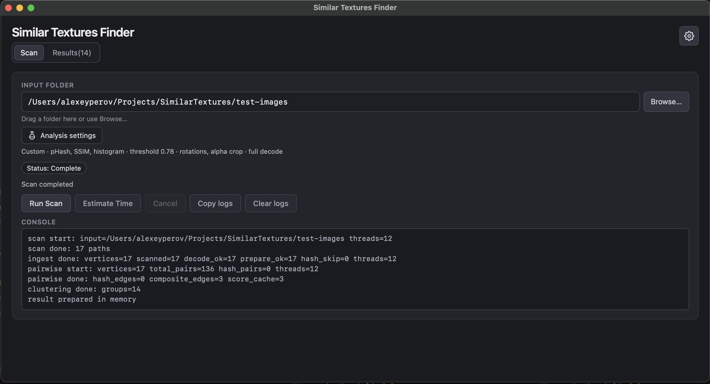
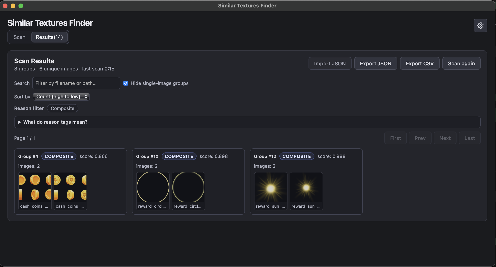

#  Similar Textures Finder

Desktop app for finding duplicate and near-duplicate texture images in a folder. Choose a library, run a scan, and review grouped results with thumbnails, similarity scores, and per-pair match reasons.

Built with [Tauri](https://tauri.app/) + Svelte. Supports PNG, JPEG, WebP, BMP, GIF, and TIFF.

## Screenshots

**Main view** — pick a folder, adjust settings, and start a scan.



**Results view** — browse grouped matches with scores and metric breakdowns.



## How it works

Scanning runs in three stages:

1. **Discover** — recursively collect image files under the chosen folder (symlinks skipped, paths deduplicated).
2. **Ingest** — for each file, compute a byte hash, decode the image, optionally preprocess it, and extract visual features.
3. **Compare & cluster** — link byte-identical files by hash, then compare remaining pairs with visual metrics. Connected images are grouped together for review.

Each pair can match for one of two reasons:

| Reason | Meaning |
|--------|---------|
| **Hash** | Files are byte-identical (same content, possibly different names). |
| **Composite** | Files differ on disk but score above the similarity threshold on enabled visual metrics. |

Groups can contain both hash and composite links (**Mixed**). Singleton groups (one image with no matches) can be hidden in Results.

---

## Algorithm & settings

Open **Settings** in the app to tune detection. All values are persisted between sessions.

### Stage 1 — File hash (exact duplicates)

Before any visual comparison, each file is hashed from raw bytes. Files with the same digest are grouped immediately — no decode required for the match itself.

| Setting | Default | Description |
|---------|---------|-------------|
| **Hash algorithm** | `sha256` | Digest used for byte-identical detection. Also supports `md5` and `sha1`. |

Pairs already linked by hash are skipped during visual comparison.

### Stage 2 — Preprocessing

Before features are extracted, each decoded image can be transformed:

| Setting | Default | Description |
|---------|---------|-------------|
| **Alpha crop** | off | Trim transparent borders using pixels with alpha above the threshold. Useful for sprite sheets and UI icons on transparent canvases. |
| **Alpha threshold** | `0.05` | Pixels with alpha below this value are treated as transparent when cropping. |
| **Rotations** | off | Also extract features for 90°, 180°, and 270° rotations. Catches the same texture saved in a different orientation. |
| **Flip** | off | Also extract features for a horizontal flip (and flipped rotations when rotations are enabled). |
| **Max decode dimension** | none | Optionally downscale large images on decode to reduce memory use. |

When rotations or flip are enabled, each image produces multiple feature sets. Pair scoring uses the **best** score across all transform combinations.

### Stage 3 — Visual metrics

Three metrics can be enabled independently. Each produces a normalized score from 0 to 1 (higher = more similar). Enabled metrics are combined into a **composite score** using configurable weights.

#### pHash (perceptual hash)

Fast fingerprint of overall image structure. The image is converted to grayscale, resized to 32×32, transformed with a 2D DCT, and reduced to a 64-bit hash from the low-frequency block.

| Setting | Default | Description |
|---------|---------|-------------|
| **Enable pHash** | on | Turn perceptual hashing on or off. |
| **pHash weight** | `0.35` | Contribution to the composite score. |
| **pHash max distance** | `10` | Maximum Hamming distance (0–64) for a pHash pair to count as valid. Lower = stricter. |

Good for: near-duplicates, re-exports, minor compression changes. Weak against: small localized differences on an otherwise identical layout (e.g. different icon on the same template).

#### SSIM (structural similarity)

Compares luminance structure after both images are resized to a square. Measures how alike the overall brightness patterns are.

| Setting | Default | Description |
|---------|---------|-------------|
| **Enable SSIM** | on | Turn structural similarity on or off. |
| **SSIM weight** | `0.45` | Contribution to the composite score. |
| **SSIM threshold** | `0.90` | Minimum raw SSIM for the metric to be valid. Acts as a **veto**: if SSIM is enabled and raw SSIM is below this value, the pair is rejected regardless of composite score. |

Good for: images that look structurally alike but differ in format or minor edits. The veto helps filter pairs where structure clearly does not match.

#### Histogram (color distribution)

Builds a 3D RGB histogram from the resized image (transparent pixels skipped) and compares distributions.

| Setting | Default | Description |
|---------|---------|-------------|
| **Enable histogram** | on | Turn histogram comparison on or off. |
| **Histogram weight** | `0.20` | Contribution to the composite score. |
| **Resize size** | `256` | Side length (px) used when resizing for SSIM and histogram extraction. |
| **Histogram bins** | `512` | Total bin count; converted to per-channel cube root internally. |
| **Histogram method** | `correlation` | Comparison method: `correlation` (Pearson, mapped to 0–1) or `bhattacharyya`. |

Good for: textures with similar palettes even when layout differs slightly.

### Composite score & threshold

The composite score is a weighted average of all **enabled** metrics that passed their validity checks:

```
composite = (w_phash × score_phash + w_ssim × score_ssim + w_histogram × score_histogram)
            / (sum of weights for valid metrics)
```

| Setting | Default | Description |
|---------|---------|-------------|
| **Threshold** | `0.85` | Minimum composite score to link two images. Raise to reduce false positives; lower to catch more near-duplicates. |

At least one visual metric must be enabled.

### Results display

| Setting | Default | Description |
|---------|---------|-------------|
| **Hide single-image groups** | on | Do not show groups that contain only one unmatched image. |

### Not yet available

ORB feature matching (`enable_orb`) is reserved in settings but not implemented in this build.

---

## Presets

Settings can be reset quickly with **Fast**, **Balanced**, or **Strict** presets in the Settings dialog.

### Balanced *(default)*

All three metrics enabled with moderate thresholds. Best starting point for most texture libraries.

| | Value |
|--|-------|
| Metrics | pHash + SSIM + histogram |
| Threshold | `0.85` |
| Weights | pHash `0.35`, SSIM `0.45`, histogram `0.20` |
| Transforms | none |

**Use when:** general-purpose deduplication — you want a reasonable trade-off between speed and accuracy without tuning individual knobs.

### Fast

Skips SSIM and transform checks; uses a higher threshold and caps decode size for speed.

| | Value |
|--|-------|
| Metrics | pHash + histogram only |
| Threshold | `0.92` |
| Weights | pHash `0.55`, histogram `0.45` |
| Max decode dimension | `512` px |
| Transforms | none |

**Use when:** scanning very large folders where runtime matters more than catching subtle structural differences. Expect fewer matches and faster scans. Good for a first pass to find obvious duplicates.

### Strict

Enables all metrics with tighter per-metric gates, plus alpha crop and rotation checks.

| | Value |
|--|-------|
| Metrics | pHash + SSIM + histogram |
| Threshold | `0.78` |
| Weights | pHash `0.35`, SSIM `0.45`, histogram `0.20` |
| pHash max distance | `12` |
| SSIM threshold | `0.88` |
| Transforms | alpha crop + rotations |

**Use when:** you need the most thorough comparison — transparent sprites, orientation variants, or libraries where Balanced misses matches. Slowest preset; run on smaller batches or overnight on large trees.

> **Tip:** If Strict produces too many false positives (e.g. same layout, different small artwork), raise **Threshold** or **SSIM threshold** manually. If Balanced misses legitimate near-duplicates, try Strict or lower Threshold slightly.

---

## Requirements

- Node.js + npm
- Rust toolchain (`rustup`, `cargo`)
- Tauri prerequisites for your OS ([platform setup guide](https://tauri.app/start/prerequisites/))

## Run

```bash
cd app
npm install
npm run tauri dev
```

The Vite dev server uses port `1440`. If startup fails, check that nothing else is bound to that port.

## Build

```bash
cd app
npm install
npm run tauri build
```

Installers and bundles are written to `app/src-tauri/target/release/bundle/`.

## Checks

```bash
cd app
npm run check
cd src-tauri && cargo test
```
